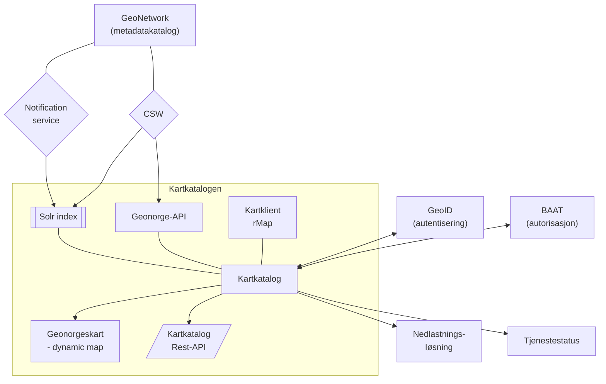

# Kartkatalog-frontend

Kartkatalogen er en tjeneste for å vise metadata som er registrert i GeoNetwork.

Kildekode og oppsettsinstruksjoner finnes i [GitHub-repoet](https://github.com/kartverket/Geonorge.Kartkatalog.React).

## Tech stack

| Kategori | Teknologi |
|---|---|
| Rammeverk | React 18, React Router 6 |
| State management | Redux 4 + Redux Thunk |
| Byggverktøy | Vite 7 |
| Styling | SCSS, Digdir Designsystem |
| Autentisering | GeoID via OIDC (`oidc-client-ts`) |
| Analyse | PostHog, Google Tag Manager |
| Testing | Jest |

## Prosjektstruktur

```
src/
├── actions/          # Redux action creators
├── reducers/         # Redux reducers
├── components/
│   ├── routes/       # Sidekomponenter (én per rute)
│   └── partials/     # Gjenbrukbare UI-komponenter
├── utils/            # Hjelpefunksjoner (store, auth, config)
├── helpers/          # URL-håndtering m.m.
└── scss/             # Globale stiler og tema
```

## Ruter

| Rute | Beskrivelse |
|---|---|
| `/` | Søkeside med fasettfiltre |
| `/metadata/{uuid}` | Detaljvisning av metadata |
| `/kart/{id}` | Interaktivt kartviser |
| `/login-oidc` | OIDC-callback fra GeoID |

## Autentisering

Innlogging håndteres via [GeoID](https://www.kartverket.no/om-kartverket/it-tjenester/geoid) (OpenID Connect). Konfigureres med `VITE_GEOID_*`-variabler i `.env`. Autorisasjon skjer mot BAAT via `VITE_GEOID_BAATAUTHZ_APIURL`.

## Bygg og deployment

Produksjonsbygget lages med `yarn build` og pakkes i et Docker-image (multi-stage: Node-bygg → Nginx runtime). GitHub Actions kjører tester, bygger image, pusher til `ghcr.io/kartverket/geonorge-kartkatalog-frontend` og oppdaterer deployment-config i `kartverket/geonorge-apps`.

Miljøkonfigurasjon injiseres dynamisk av Nginx via `/config.js` ved oppstart, slik at samme image kan brukes i alle miljøer.

## Systemarkitektur




