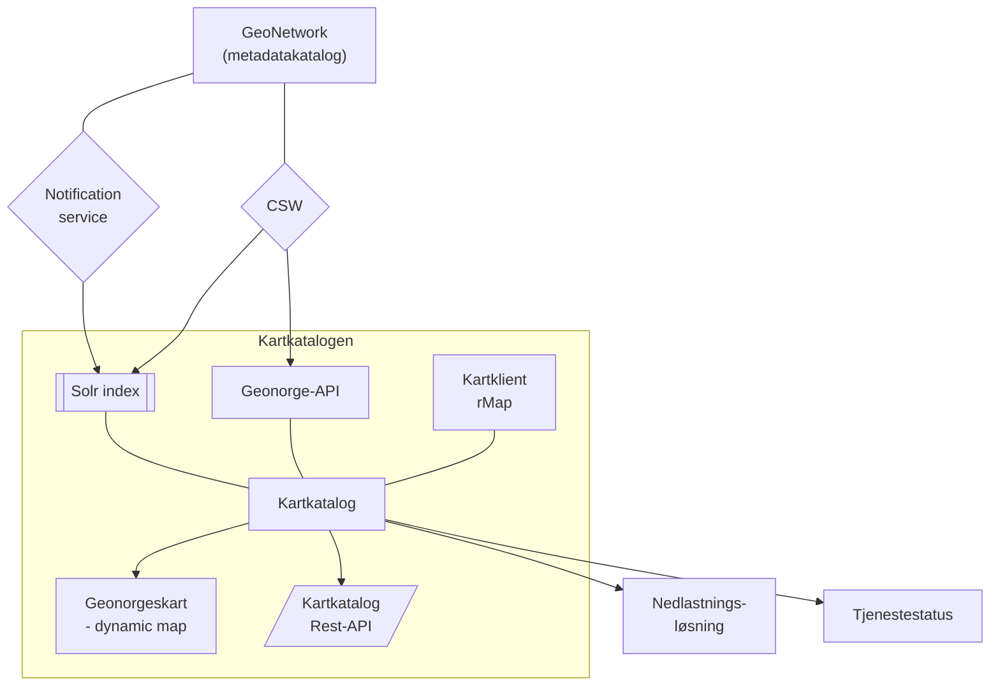

> [!CAUTION]
> Dette repoet er IKKE Kartkatalog-modulen til Geonorge. Dette er en eksperimentell omskriving av autentisering og autorisasjon basert på arbeidet til "Tilgangsstyring i Landdivisjonen" for å finne nye og moderne metoder for å gjøre tilgangsstyring. Repo til Kartkatalogen finner du [her](https://github.com/kartverket/Geonorge.Kartkatalog.React)

# Kartkatalog-frontend

Kartkatalogen er en tjeneste for å vise metadata som er registrert i GeoNetwork.

Kildekode og oppsettsinstruksjoner finnes i [GitHub-repoet](https://github.com/kartverket/Geonorge.Kartkatalog.React).

## Tech stack

| Kategori          | Teknologi                           |
|-------------------|-------------------------------------|
| Rammeverk         | React 18, React Router 6            |
| State management  | Redux 4 + Redux Thunk               |
| Byggverktøy       | Vite 7                              |
| Styling           | SCSS, Digdir Designsystem           |
| **Autentisering** | **Under utvikling (Ansattporten)**  |
| Analyse           | PostHog, Google Tag Manager         |
| Testing           | Jest                                |

## Prosjektstruktur

```
src/
├── actions/          # Redux action creators
├── reducers/         # Redux reducers
├── components/
│   ├── routes/       # Sidekomponenter (én per rute)
│   └── partials/     # Gjenbrukbare UI-komponenter
├── utils/            # Hjelpefunksjoner (store, auth, config)
├── helpers/          # URL-håndtering m.m.
└── scss/             # Globale stiler og tema
```

## Ruter

| Rute | Beskrivelse |
|---|---|
| `/` | Søkeside med fasettfiltre |
| `/metadata/{uuid}` | Detaljvisning av metadata |
| `/kart/{id}` | Interaktivt kartviser |

## Autentisering

Skal skje med Ansattporten som henter informasjon fra Altinn. Mer info etterhvert som det kommer på plass.

## Bygg og deployment

Produksjonsbygget lages med `yarn build` og pakkes i et Docker-image (multi-stage: Node-bygg → Nginx runtime). GitHub Actions kjører tester, bygger image, pusher til `ghcr.io/kartverket/geonorge-kartkatalog-frontend` og oppdaterer deployment-config i `kartverket/geonorge-apps`.

Miljøkonfigurasjon injiseres dynamisk av Nginx via `/config.js` ved oppstart, slik at samme image kan brukes i alle miljøer.

## Systemarkitektur

TODO, få inn den nye autentiseringen her


```mermaid
flowchart TD
    GN["GeoNetwork\n(metadatakatalog)"]
    NS{Notification\nservice}
    CSW{CSW}

    subgraph core["Kartkatalogen"]
        API["Geonorge-API"]
        Solr[["Solr index"]]
        rMap["Kartklient\nrMap"]
        KK["Kartkatalog"]
        GKart["Geonorgeskart\n- dynamic map"]
        RestAPI[/"Kartkatalog\nRest-API"/]
    end

    GN --- NS
    GN --- CSW
    NS --> Solr
    CSW --> Solr
    CSW --> API
    API --- KK
    Solr --- KK
    rMap --- KK
    KK --> GKart
    KK --> RestAPI
    KK --> Nedlasting["Nedlastnings-\nløsning"]
    KK --> Tjenestestatus["Tjenestestatus"]
```


